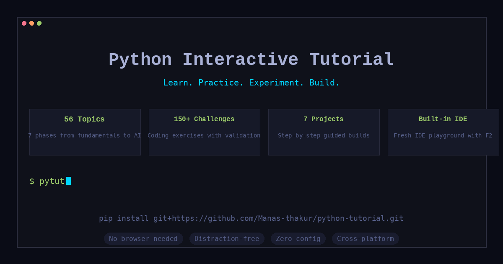
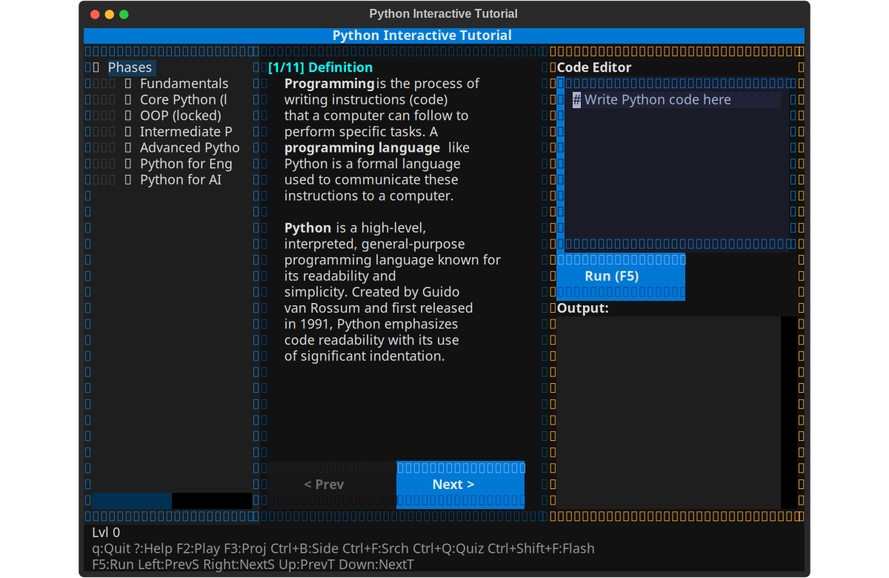
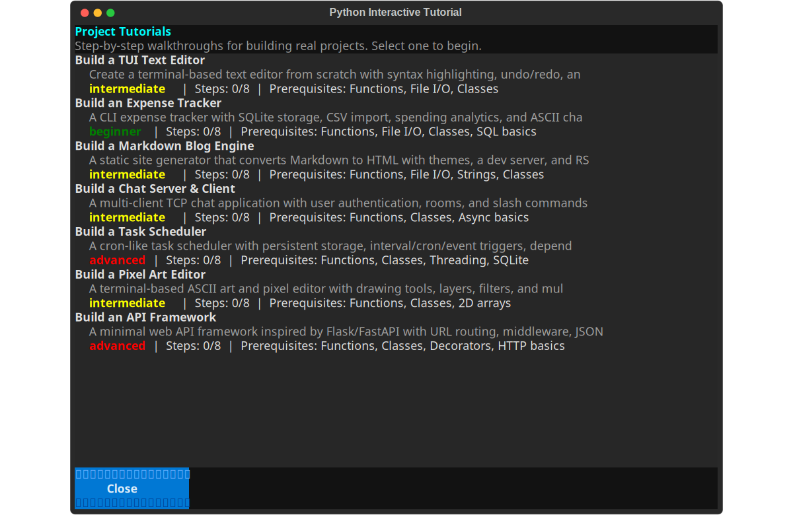
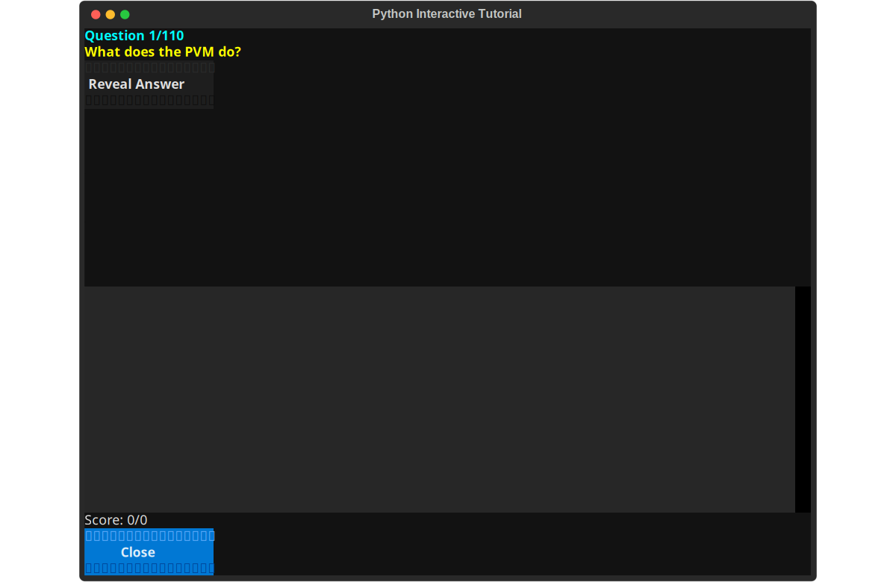
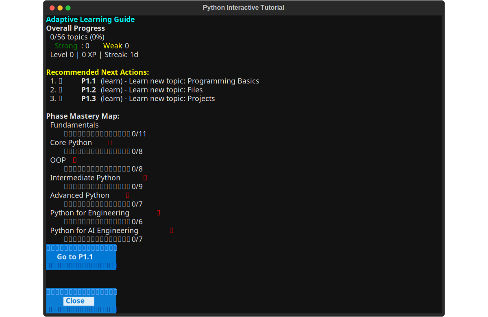
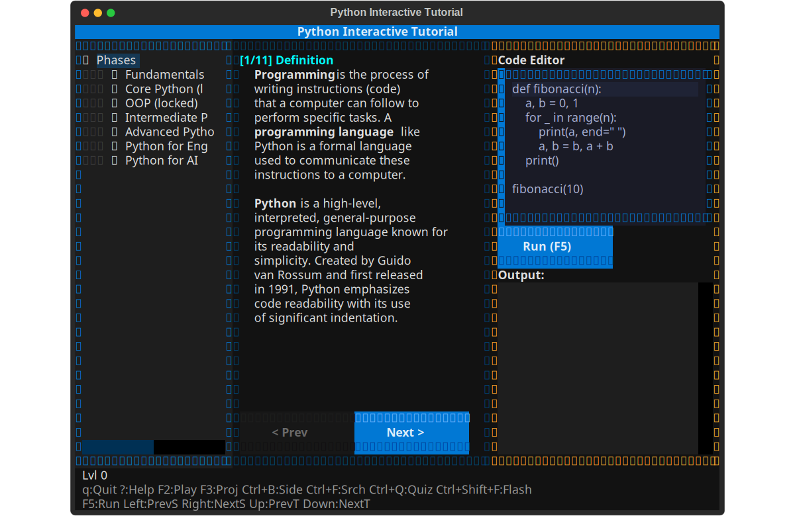
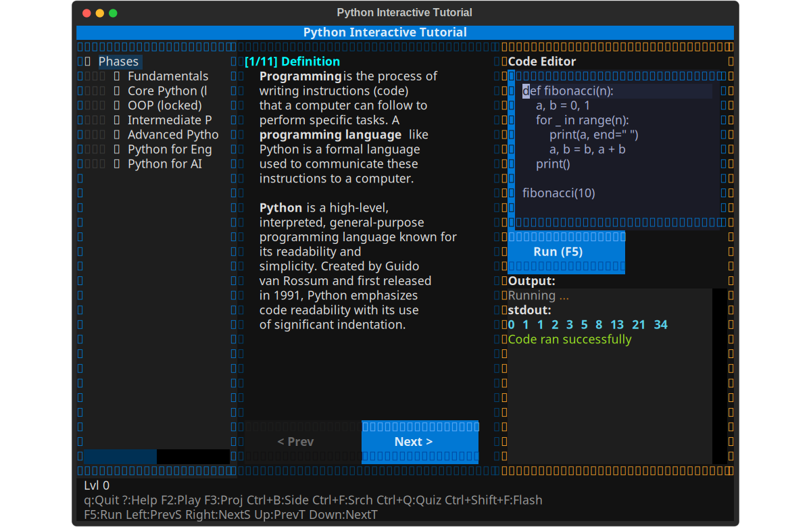
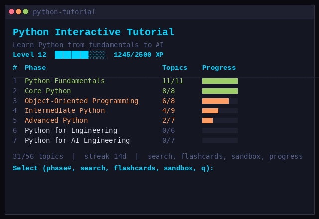
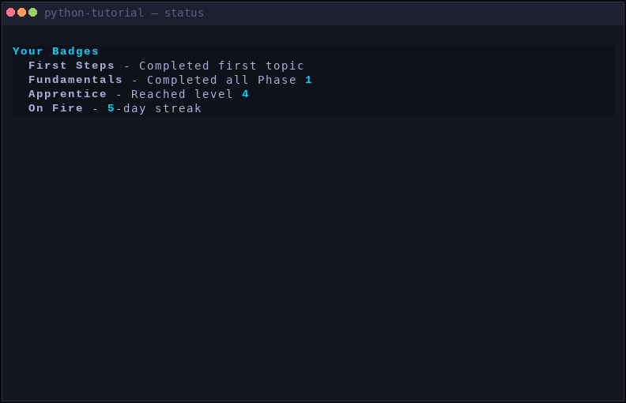

<p align="center">
  
</p>

<p align="center">
  Learn Python from zero to building 7 real projects — all from your terminal, zero distractions.
</p>

<p align="center">
  <a href="#-installation"><b>Install</b></a> •
  <a href="#-quick-start"><b>Quick Start</b></a> •
  <a href="#-screenshots"><b>Screenshots</b></a> •
  <a href="#-the-learning-path"><b>Learning Path</b></a> •
  <a href="#-features"><b>Features</b></a>
</p>

---

## 📦 Installation

```bash
pip install git+https://github.com/Manas-thakur/python-tutorial.git
pytut
```

That's it. No browser, no IDE setup, no dependencies to install. Everything runs in your terminal.

### Upgrading

When a new version is released, update with:

```bash
pip install --no-cache-dir --force-reinstall git+https://github.com/Manas-thakur/python-tutorial.git
```

This clears the pip cache and forces a fresh install from the latest commit.

---

## 🚀 Quick Start

```bash
# Launch the interactive TUI
pytut

# Or use CLI commands
python-tutorial list           # View all phases and topics
python-tutorial view 1 1       # Read a specific topic
python-tutorial quiz           # Take a quiz
python-tutorial status         # View your progress
```

### CLI Commands

| Command | Description |
|---------|-------------|
| `python-tutorial` | Interactive TUI (default) |
| `list` | List all phases and topics |
| `view <phase> <topic>` | Read a specific topic |
| `quiz [phase]` | Take a quiz (optionally for a phase) |
| `challenge <phase> <topic>` | Solve a coding challenge |
| `projects` | Browse 7 project tutorials |
| `sandbox` | Open the code playground |
| `search <term>` | Search all content |
| `flashcards [phase]` | Review with flashcards |
| `status` | Show progress, level, XP, badges |
| `badges` | Show earned badges |
| `bookmark` | Show saved position |

### TUI Keyboard Shortcuts

| Key | Action |
|-----|--------|
| `F2` | Open Fresh IDE (playground) |
| `F3` | Browse project tutorials |
| `F5` | Run current code |
| `Ctrl+F` | Search all topics |
| `Ctrl+Q` | Start quiz |
| `Ctrl+Shift+F` | Open flashcards |
| `Ctrl+T` | Open tutor dashboard |
| `Ctrl+B` | Toggle sidebar |
| `C` | Toggle content panel |
| `Ctrl+Shift+P` | Playground keybindings cheat sheet |
| `?` | Open help |
| `Up` / `Down` | Previous / Next topic |
| `Left` / `Right` | Previous / Next section |
| `Enter` | Confirm / advance quiz |
| `Escape` | Close current screen |
| `q` | Quit |
| `r` | Reset progress |

---

## 📸 Screenshots

<p align="center">
  
  <br><em>Main interface — sidebar with phase list, content panel, and code editor</em>
</p>

<p align="center">
  
  <br><em>Project tutorial browser — 7 guided projects with progress tracking</em>
</p>

<p align="center">
  
  <br><em>Quiz mode — knowledge checks after each topic</em>
</p>

<p align="center">
  
  <br><em>Adaptive tutor dashboard — personalized recommendations based on mastery</em>
</p>

<p align="center">
  
  <br><em>Code panel — syntax-highlighted examples, runnable with F5</em>
</p>

<p align="center">
  
  <br><em>Fresh IDE playground — full terminal-based editor (F2)</em>
</p>

<p align="center">
  
  <br><em>CLI welcome — phase roadmap and progress overview</em>
</p>

<p align="center">
  
  <br><em>CLI status — detailed progress, XP level, streaks, badges</em>
</p>

---

## 🧭 The Learning Path

```
Learn ──► Practice ──► Experiment ──► Build
  │           │              │              │
  │ 56 topics │  150+ exer.  │  Code sandbox│  7 projects
  │ 7 phases  │  Quizzes     │  Fresh IDE   │  8 steps each
  │           │  Flashcards  │              │
```

### 1. Learn — 56 Topics Across 7 Phases

| Phase | Topics | What You'll Learn |
|-------|--------|-------------------|
| **Phase 1: Python Fundamentals** | 11 | Variables, data types, control flow, loops, functions, strings, lists, dicts, error handling |
| **Phase 2: Core Python** | 8 | Modules, packages, file I/O, pathlib, virtual environments, pip, testing |
| **Phase 3: OOP** | 8 | Classes, inheritance, polymorphism, magic methods, properties, composition |
| **Phase 4: Intermediate Python** | 9 | Decorators, generators, context managers, iterators, closures, lambdas, comprehensions |
| **Phase 5: Advanced Python** | 7 | Metaclasses, descriptors, concurrency, async/await, C extensions, performance |
| **Phase 6: Python for Engineering** | 6 | NumPy, Pandas, Matplotlib, SciPy, data pipelines, environment variables |
| **Phase 7: Python for AI** | 7 | PyTorch basics, LangChain, RAG, agents, vector databases, model deployment |

Each topic is displayed one section at a time — no overwhelming walls of text. Syntax-highlighted code examples with line-by-line explanations.

### 2. Practice — Challenges, Quizzes & Flashcards

**Coding Challenges** — Every topic ends with a challenge. Write real code, get validated against expected output. Difficulty scales from easy to medium to hard.

**Quizzes** — Multiple-choice and open-ended questions covering each topic. Tracks your score and feeds into the mastery system.

**Flashcards** — Spaced-repetition review with self-rating (Again / Hard / Good / Easy). Prioritizes weak topics automatically.

### 3. Experiment — Built-in IDE / Sandbox

Press `F2` to open **Fresh IDE** — a full terminal-based code editor featuring:
- Syntax highlighting for Python
- Multiple cursors and selections
- File explorer sidebar
- Integrated terminal
- Search and replace
- Undo / redo history
- All sandbox code auto-saves between sessions

### 4. Build — 7 Project Tutorials

Each project is a step-by-step walkthrough (8 steps each) with a starter skeleton and a complete solution:

| Project | Difficulty | Key Concepts |
|---------|-----------|--------------|
| **Expense Tracker** | Beginner | SQLite, argparse, CSV parsing, ASCII charts |
| **TUI Text Editor** | Intermediate | Gap buffers, raw terminal, ANSI codes, regex |
| **Markdown Blog Engine** | Intermediate | Markdown parsing, templates, SSE, RSS |
| **Chat Server & Client** | Intermediate | asyncio, TCP protocols, auth, rooms |
| **Pixel Art Editor** | Intermediate | 2D arrays, flood fill, Bresenham lines, filters |
| **Task Scheduler** | Advanced | Cron triggers, subprocess, web dashboard |
| **API Framework** | Advanced | URL routing, middleware, HTTP, decorators |

---

## ✨ Features

- **Adaptive Tutor Dashboard** (`Ctrl+T`) — Personalized recommendations based on mastery. Recommends what to review, what to learn next, and where you're weak.
- **Mastery-Based Progression** — Topics unlock as you demonstrate understanding through quizzes and flashcards, not just reading.
- **XP & Leveling** — Earn XP for completing topics, challenges, and quizzes. Level up with quadratic scaling.
- **Learning Streaks** — Daily usage builds streaks. Badges unlock at 3, 7, and 30 days.
- **Badges** — 15+ achievements: First Steps, Fundamentals, OOP Master, Pythonista, On Fire, and more.
- **Automatic Bookmarking** — Saves your position automatically. Prompts to resume on relaunch.
- **Full-Text Search** (`Ctrl+F`) — Instantly search across all 56 topics.
- **Error Explainer** — Plain-English explanations for 13 common Python errors.
- **Code Validation** — Challenge runner validates your code against expected output with diff highlighting.
- **Project Progress** — Track your build progress across all 7 projects.
- **Progress Reset** (`r`) — Reset all progress and start fresh.

### Progress System

| Mechanic | How It Works |
|----------|-------------|
| **XP** | Complete topics (+25), challenges (+50), quizzes (+10 per correct) |
| **Levels** | Quadratic scaling: `level * (level + 1) * 25` XP per level |
| **Streaks** | Consecutive daily usage tracked automatically |
| **Mastery** | `weak` → `medium` → `strong` based on quiz/flashcard performance |
| **Unlocking** | Phase N+1 unlocks when Phase N is 70%+ complete |
| **Bookmarks** | Auto-saved on each topic change; resume prompt on restart |

---

## 🔧 Development

```bash
git clone https://github.com/Manas-thakur/python-tutorial.git
cd python-tutorial
pip install -e .
```

### Project Structure

```
python_tutorial/
├── cli.py           # Typer CLI interface
├── content/         # 56 topic markdown files (7 phases)
├── projects/        # 7 project tutorial implementations
├── progress.py      # Progress tracking (XP, streaks, badges)
├── tutor.py         # Adaptive tutor engine
├── challenges.py    # Coding challenge definitions
├── flashcard.py     # Flashcard engine
├── quiz.py          # Quiz engine
├── sandbox.py       # Code sandbox
├── renderer.py      # Rich console rendering
├── themes.py        # Terminal color themes
├── models.py        # Data models
├── tui/             # Textual TUI
│   ├── app.py       # Main TUI application
│   ├── screens.py   # All screens (quiz, tutor, search, projects, help)
│   ├── sidebar.py   # Phase/topic sidebar
│   ├── code_panel.py    # Code editor panel
│   └── content_panel.py # Topic content panel
project-submissions/ # Standalone project READMEs (submission-ready)
banner/             # Screenshots and banner images
```

### Screenshots

To regenerate screenshots:

```bash
# TUI screenshots (requires DISPLAY/Xvfb for cairosvg)
python3 capture_tui_screenshots.py

# CLI screenshots
python3 generate_real_screenshots.py

# Banner
python3 generate_banner.py
```

---

## 📄 License

MIT
